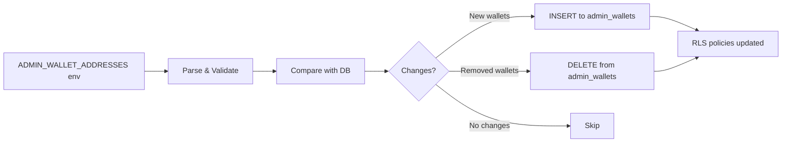

# 🔒 Security Implementation Guide

## Critical Security Fixes

### ⚠️ Vulnerability #1: Audit Logs Publicly Readable

**Issue:** Any authenticated user could read all audit logs including:
- All user activities, IP addresses, device info
- Admin actions and blocking reasons
- Support transactions and amounts
- Sensitive geolocation data

**Impact:** Complete privacy breach, attackers could map all platform activity.

**Status:** ✅ **FIXED** via Migration `20250117000003`

---

### ⚠️ Vulnerability #2: Admin Functions Accessible to All Users (CRITICAL)

**Issue:** Six admin-only functions had NO authentication checks:
1. `admin_blacklist_wallet` - Any user could blacklist any wallet
2. `admin_unblacklist_wallet` - Any user could unblacklist wallets
3. `admin_deactivate_user` - Any user could deactivate creator accounts
4. `admin_reactivate_user` - Any user could reactivate accounts
5. `admin_get_analytics` - Any user could view platform analytics
6. `admin_search_users` - Any user could search ALL users (with emails & wallet addresses)

**Attack Vector:**
```typescript
// Any authenticated user could call:
const { data } = await supabase.rpc('admin_blacklist_wallet', {
  p_wallet_address: 'VICTIM_WALLET',
  p_reason: 'Attacker blacklisting innocent user'
})
// ✅ Would succeed without admin check!
```

**Impact:**
- **Complete platform takeover** - Malicious users could:
  - Blacklist competitors' wallets
  - Deactivate successful creators
  - View all user emails and wallet addresses
  - Access platform analytics
  - Cause platform-wide chaos

**Status:** ✅ **FIXED** via Migration `20250117000004`

**Fix Applied:**
- Added `is_admin_user()` check to all 6 functions
- Functions now raise exception if caller is not in `admin_wallets` table
- Added REVOKE/GRANT permissions for defense in depth

---

## 🛡️ Security Architecture

### Multi-Layer Security Model

```
┌─────────────────────────────────────────┐
│  Layer 1: Application (Next.js)         │
│  - isAdminWallet() check                │
│  - Environment variable validation      │
└─────────────────────────────────────────┘
                    ↓
┌─────────────────────────────────────────┐
│  Layer 2: Database (RLS Policies)       │
│  - is_admin_user() function             │
│  - admin_wallets table lookup           │
└─────────────────────────────────────────┘
                    ↓
┌─────────────────────────────────────────┐
│  Layer 3: Data Access                   │
│  - Server Components only               │
│  - No client-side data leakage          │
└─────────────────────────────────────────┘
```

---

## 📋 Migration Setup (CRITICAL)

### Required Migrations (Run in Order)

```sql
-- 1. User blocking & enhanced audit logs
20250117000000_add_user_blocking_and_enhanced_audit_logs.sql

-- 2. Auth triggers (login/signup/logout)
20250117000001_add_auth_audit_triggers.sql

-- 3. Admin & audit security fixes
20250117000002_fix_admin_and_audit_issues.sql

-- 4. CRITICAL: Audit logs admin-only protection
20250117000003_secure_audit_logs_admin_only.sql  ← MUST RUN!

-- 5. CRITICAL: Secure all admin functions
20250117000004_secure_all_admin_functions.sql  ← MUST RUN!
```

**⚠️ IMPORTANT:** Migrations 3, 4, and 5 are CRITICAL security fixes. Do NOT skip them!

### Post-Migration Steps

#### Step 1: Sync Admin Wallets to Database

**Option A: Via API (Recommended)**
```bash
# After deployment, call the sync endpoint once
curl -X POST https://cobbee.fun/api/admin/sync-wallets \
  -H "Authorization: Bearer YOUR_ADMIN_TOKEN"
```

**Option B: Manual SQL (Supabase Dashboard)**
```sql
-- Insert your admin wallet addresses
INSERT INTO public.admin_wallets (wallet_address, notes)
VALUES
  ('0xYourAdminWallet1', 'Primary admin - Deployed on YYYY-MM-DD'),
  ('0xYourAdminWallet2', 'Secondary admin')
ON CONFLICT (wallet_address) DO NOTHING;
```

**Option C: Automatic Sync on Startup**
```typescript
// In your Next.js app startup (e.g., middleware.ts or layout.tsx)
import { syncAdminWallets } from '@/lib/utils/sync-admin-wallets'

// Run once on cold start
syncAdminWallets().catch(console.error)
```

#### Step 2: Verify Security

```sql
-- Test 1: Check admin wallets are synced
SELECT * FROM public.admin_wallets;
-- Should return your admin wallet addresses

-- Test 2: Verify RLS is enabled
SELECT tablename, rowsecurity
FROM pg_tables
WHERE schemaname = 'public' AND tablename = 'audit_logs';
-- rowsecurity should be 't' (true)

-- Test 3: Try to access as non-admin (should fail)
-- Login as regular user, then:
SELECT * FROM public.audit_logs LIMIT 1;
-- Should return 0 rows (blocked by RLS)
```

---

## 🔐 RLS Policies Overview

### audit_logs Table

| Policy | Who | Action | Rule |
|--------|-----|--------|------|
| **Admin only can SELECT** | `authenticated` | `SELECT` | `is_admin_user() = true` |
| **Allow INSERT for authenticated** | `authenticated`, `anon` | `INSERT` | `true` (safe - logs own actions) |
| **Service role full access** | `service_role` | `ALL` | `true` (migrations, triggers) |
| **No UPDATE allowed** | `authenticated` | `UPDATE` | `false` (immutable logs) |
| **No DELETE allowed** | `authenticated` | `DELETE` | `false` (immutable logs) |

### users Table

| Policy | Who | Action | Rule |
|--------|-----|--------|------|
| **Users can view own data** | `authenticated` | `SELECT` | `id = auth.uid()` |
| **Admins can view all users** | `authenticated` | `SELECT` | `is_admin_user() = true` |

### admin_wallets Table

| Policy | Who | Action | Rule |
|--------|-----|--------|------|
| **Anyone can SELECT** | `authenticated` | `SELECT` | `true` (needed for RLS checks) |
| **Service role can modify** | `service_role` | `INSERT`, `UPDATE`, `DELETE` | `true` |

---

## 🚨 Security Checklist

### Before Deployment

- [ ] Run all 5 migrations in order (especially 3, 4, 5 - CRITICAL security fixes)
- [ ] Set `ADMIN_WALLET_ADDRESSES` environment variable
- [ ] Sync admin wallets to database (API or SQL)
- [ ] Verify RLS is enabled on `audit_logs`
- [ ] Test admin access works
- [ ] Test non-admin access is blocked
- [ ] Test non-admin CANNOT call admin functions (should get "Unauthorized" error)

### After Deployment

- [ ] Call `/api/admin/sync-wallets` to sync env vars
- [ ] Verify admin panel loads (`/admin/audit`)
- [ ] Attempt to access audit logs as non-admin (should fail)
- [ ] Check Supabase logs for RLS violations

### Regular Maintenance

- [ ] Sync admin wallets when `ADMIN_WALLET_ADDRESSES` changes
- [ ] Review audit logs weekly for suspicious activity
- [ ] Monitor failed RLS policy attempts in Supabase logs

---

## 🔍 Attack Scenarios & Mitigations

### Scenario 1: Regular User Tries to Read Audit Logs

**Attack:**
```sql
-- Attacker logs in as regular user, attempts:
SELECT * FROM audit_logs;
```

**Mitigation:**
- ✅ RLS policy blocks: `is_admin_user() = false`
- Returns 0 rows
- No error message (silent deny)

### Scenario 2: SQL Injection in API Routes

**Attack:**
```javascript
fetch('/api/user/profile', {
  method: 'PATCH',
  body: JSON.stringify({
    username: "admin'; DROP TABLE audit_logs; --"
  })
})
```

**Mitigation:**
- ✅ Supabase client uses parameterized queries
- ✅ Input validation via Zod schemas
- ✅ XSS sanitization with DOMPurify
- RLS prevents table drops anyway

### Scenario 3: Direct Database Function Call

**Attack:**
```typescript
// Attacker tries to call admin functions directly via Supabase client
const supabase = createClient()
const { data } = await supabase.rpc('admin_deactivate_user', {
  p_user_id: 'VICTIM_USER_ID',
  p_reason: 'Malicious deactivation'
})
```

**Mitigation:**
- ✅ All admin functions check `is_admin_user()` first
- ✅ Non-admin calls raise exception: "Unauthorized: Only admins can..."
- ✅ Function never executes if caller not in `admin_wallets` table
- ✅ REVOKE/GRANT permissions provide additional defense layer

### Scenario 4: Admin Impersonation

**Attack:**
- Attacker tries to call admin endpoints directly
- Or modifies JWT to claim admin status

**Mitigation:**
- ✅ Server-side wallet verification in every admin route
- ✅ Database-level RLS double-checks wallet
- ✅ Database functions check `is_admin_user()`
- ✅ `ADMIN_WALLET_ADDRESSES` is server-side only
- JWT modification won't help (wallet check fails)

### Scenario 5: Compromised Admin Wallet

**Attack:**
- Admin wallet private key is stolen
- Attacker logs in as admin

**Mitigation:**
- ⚠️ **Immediate Action Required:**
  1. Remove compromised wallet from `ADMIN_WALLET_ADDRESSES`
  2. Call `/api/admin/sync-wallets` to remove from DB
  3. Review audit logs for malicious activity
  4. Rotate any other credentials
- 📝 **Prevention:** Use hardware wallets, never share keys

---

## 📊 Audit Log Security Features

### What's Protected

✅ **Fully Protected (Admin-Only):**
- All audit log entries
- User IP addresses
- Geolocation data (city, country, lat/long)
- Device information (type, brand, model)
- Browser and OS details
- Session IDs
- User activity patterns

✅ **Self-Only Access:**
- Users can only INSERT their own actions
- Cannot read other users' audit logs
- Cannot modify or delete any logs

### What's Visible to Regular Users

❌ **Nothing** - Regular users cannot:
- Read audit_logs table
- Access admin views (admin_recent_activity)
- See other users' activities
- View IP addresses or device info

---

## 🛠️ Admin Wallet Management

### Adding Admin Wallets

**Via Environment Variable (Recommended):**
```bash
# .env.local or Vercel Environment Variables
ADMIN_WALLET_ADDRESSES=0xWallet1,0xWallet2,0xWallet3

# Then sync:
POST /api/admin/sync-wallets
```

**Via Database Function (Admin-Only):**
```sql
-- Only existing admins can call this
SELECT public.add_admin_wallet(
  '0xNewAdminWallet',
  'Added for security team'
);
```

### Removing Admin Wallets

**Via Environment Variable:**
```bash
# Remove from ADMIN_WALLET_ADDRESSES
# Then sync to remove from database
POST /api/admin/sync-wallets
```

**Via Database Function:**
```sql
-- Cannot remove your own wallet (prevents lockout)
SELECT public.remove_admin_wallet('0xOldAdminWallet');
```

---

## 🔄 Sync Process

### How Admin Wallet Sync Works



### Automatic Sync (Optional)

Add to `middleware.ts` or API route:

```typescript
import { syncAdminWallets } from '@/lib/utils/sync-admin-wallets'

// Sync every hour
setInterval(async () => {
  const result = await syncAdminWallets()
  if (!result.success) {
    console.error('Admin wallet sync failed:', result.error)
  }
}, 60 * 60 * 1000)
```

---

## 📝 Best Practices

### Environment Variables

- ✅ Store `ADMIN_WALLET_ADDRESSES` in Vercel/server environment only
- ✅ Use comma-separated lowercase addresses
- ✅ Never commit to git
- ✅ Rotate when admin leaves team

### Database

- ✅ Keep migrations in version control
- ✅ Test migrations in staging first
- ✅ Backup database before running migrations
- ✅ Review RLS policies quarterly

### Monitoring

- ✅ Set up alerts for failed RLS attempts
- ✅ Review audit logs weekly
- ✅ Monitor admin_wallets table changes
- ✅ Track unauthorized access attempts

---

## 🚀 Deployment Checklist

### Pre-Deploy

1. ✅ All migrations ready in `supabase/migrations/`
2. ✅ `ADMIN_WALLET_ADDRESSES` set in Vercel
3. ✅ Build passes: `pnpm build`
4. ✅ TypeScript check: `npx tsc --noEmit`

### Deploy

1. ✅ Push to production
2. ✅ Run migrations in Supabase Dashboard (or via CLI)
3. ✅ Call `/api/admin/sync-wallets` once
4. ✅ Verify admin panel works

### Post-Deploy

1. ✅ Test admin access to `/admin/audit`
2. ✅ Test non-admin blocked from audit logs
3. ✅ Check Supabase logs for errors
4. ✅ Verify geolocation data populating

---

## 📞 Security Incident Response

### If Audit Logs Are Compromised

1. **Immediate:** Revoke all admin access temporarily
2. **Investigate:** Review all audit log entries for unauthorized access
3. **Rotate:** Change `ADMIN_WALLET_ADDRESSES`
4. **Notify:** Inform affected users if PII was exposed
5. **Fix:** Identify and patch vulnerability
6. **Monitor:** Watch for follow-up attacks

### Reporting Security Issues

**DO NOT** open public GitHub issues for security vulnerabilities.

Instead:
- Email: security@cobbee.fun
- Include: Steps to reproduce, impact, suggested fix
- Response time: 24-48 hours

---

## 📚 References

- [Supabase RLS Documentation](https://supabase.com/docs/guides/auth/row-level-security)
- [PostgreSQL Security Best Practices](https://www.postgresql.org/docs/current/security.html)
- [OWASP Top 10](https://owasp.org/www-project-top-ten/)
- [Next.js Security Headers](https://nextjs.org/docs/app/building-your-application/configuring/security-headers)

---

**Last Updated:** 2025-01-17
**Version:** 2.0.0
**Security Level:** CRITICAL
**Maintainer:** Cobbee Security Team
